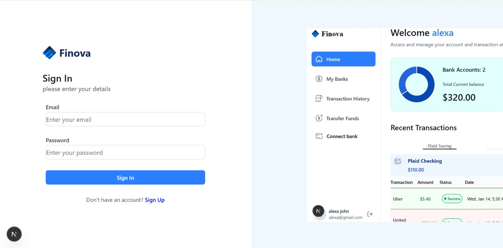
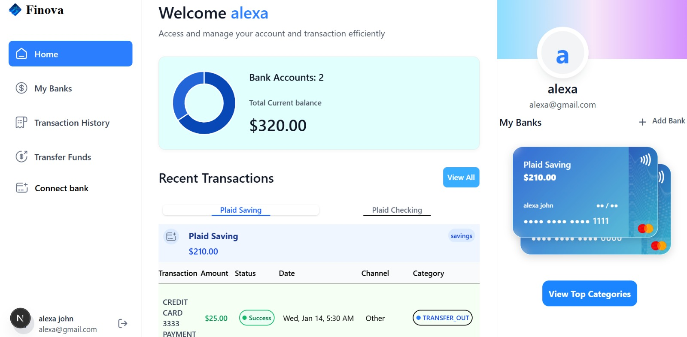
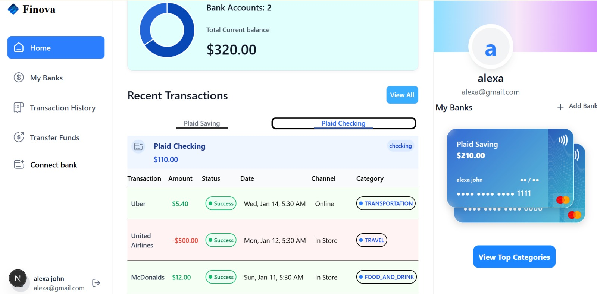
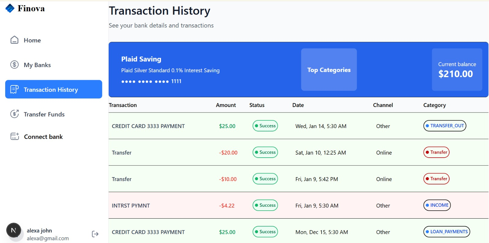
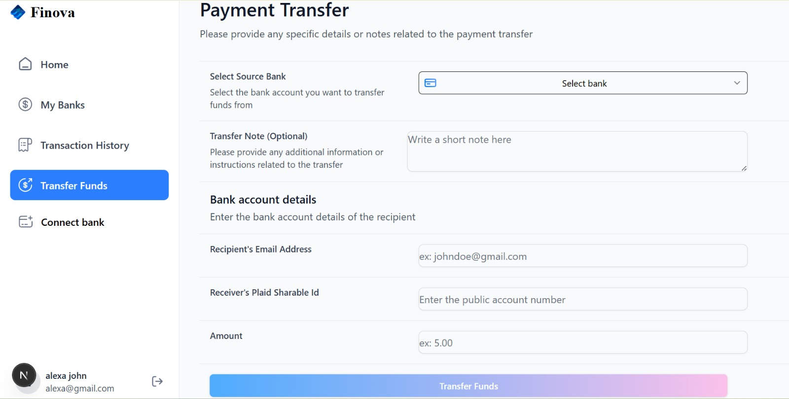
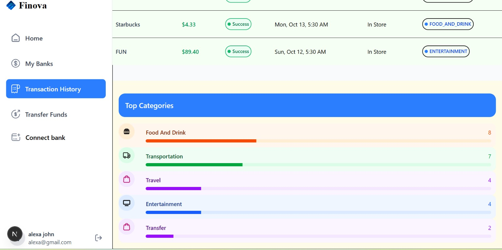
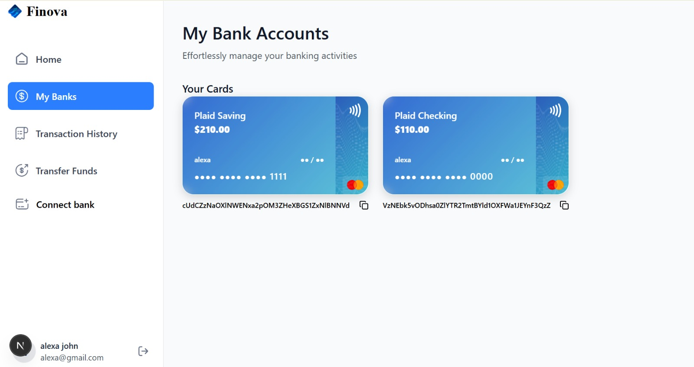

# Finova Banking Application

## Overview
The Finova Banking Application is a modern, responsive web application designed to provide users with a seamless banking experience. It includes features such as account management, transaction history, payment transfers, and more. Built with Next.js, TypeScript, and Tailwind CSS, the application ensures high performance and scalability.

## Features

- **Authentication**:
  
  Secure sign-in and sign-up flows with modern authentication mechanisms to ensure user data is protected. Users can reset passwords and manage account security settings.
  
  

- **Account Management**:
  
  View and manage multiple bank accounts in one place. Users can add, edit, or remove accounts and see a summary of their balances.
  
  
  
  

- **Transaction History**:
  
  Detailed transaction records with filtering and sorting options. Users can search for specific transactions and view categorized spending insights.
  
  

- **Payment Transfers**:
  
  Easy and secure payment transfers between accounts or to external recipients. Includes real-time validation and confirmation of transactions.
  
  

- **Charts and Analytics**:
  
  Visualize financial data with interactive charts and graphs. Users can track spending trends, income sources, and savings goals.
  
  

- **View Bank Cards**:
   
  Users can view their bank cards, including details like card number, expiration date, and card type, in a secure interface.
  
  

- **Responsive Design**: 
  Optimized for both desktop and mobile devices, ensuring a seamless experience across all screen sizes.


## Project Structure
```
app/
  globals.css          # Global styles
  layout.tsx           # Root layout
  (auth)/              # Authentication pages
  (root)/              # Main application pages
    my-banks/          # Manage banks
    payment-transfer/  # Payment transfer functionality
    transaction-history/ # Transaction history

components/
  ui/                  # Reusable UI components
  ...                  # Other components like forms, charts, etc.

lib/
  appwrite.ts          # Appwrite integration
  plaid.ts             # Plaid API integration
  utils.ts             # Utility functions

public/
  icons/               # Static assets

types/
  index.d.ts           # TypeScript type definitions
```

## Technologies Used
- **Next.js**: React framework for server-side rendering and static site generation.
- **TypeScript**: Strongly typed programming language.
- **Tailwind CSS**: Utility-first CSS framework.
- **Appwrite**: Backend-as-a-service platform.
- **Plaid**: Financial data aggregation API.

## Getting Started
### Prerequisites
- Node.js (v16 or higher)
- npm or yarn

### Installation
1. Clone the repository:
   ```bash
   git clone <repository-url>
   ```
2. Navigate to the project directory:
   ```bash
   cd banking
   ```
3. Install dependencies:
   ```bash
   npm install
   ```

### Running the Application
1. Start the development server:
   ```bash
   npm run dev
   ```
2. Open your browser and navigate to `http://localhost:3000`.

### Building for Production
1. Build the application:
   ```bash
   npm run build
   ```
2. Start the production server:
   ```bash
   npm start
   ```

## Contributing
Contributions are welcome! Please fork the repository and submit a pull request.


## Acknowledgments
- [Next.js Documentation](https://nextjs.org/docs)
- [Tailwind CSS Documentation](https://tailwindcss.com/docs)
- [Appwrite Documentation](https://appwrite.io/docs)
- [Plaid Documentation](https://plaid.com/docs)
